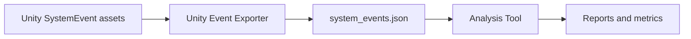

# Game State Analyzer

The Game State Analyzer is a two-part toolkit for exporting and evaluating event-driven game state systems.

It is built around a simple workflow:

1. Author event data in a game engine (only Unity for now).
2. Export those events to JSON.
3. Analyze the exported JSON with the standalone analysis tool.

This repository contains both halves of that pipeline:

- `Unity Event Exporter` for extracting Unity-authored event assets into structured JSON
- `Analysis Tool` for graphing, simulating, and reporting on branching state behavior

## Repository Layout

```text
Game State Analyzer/
├── Analysis Tool/
├── Unity Event Exporter/
├── CONTRIBUTING.md
├── LICENSE.md
└── README.md
```

## Projects

### Analysis Tool

The Analysis Tool is a Python application for evaluating Unity-exported event data.

It can:

- load exported event JSON
- initialize runtime state from a special `runtime_state` event
- build an event-variable interaction graph
- explore reachable game states
- compute structural and branching metrics
- write timestamped reports for review

Typical use cases include:

- checking branching complexity before production scales up
- spotting heavily shared or collision-prone variables
- estimating state-space growth
- reviewing reachability and transition depth

See the project README for more detail:
[Analysis Tool README]

### Unity Event Exporter

The Unity Event Exporter is a Unity editor package for exporting `SystemEvent` ScriptableObjects to JSON.

It can:

- find all `SystemEvent` assets in a Unity project
- validate event IDs, sequence references, and mutation structure
- normalize exported names for consistency
- write a single JSON file suitable for downstream analysis

Typical use cases include:

- collecting narrative/event assets into a single portable dataset
- catching schema and content problems before analysis
- bridging Unity authoring workflows with external tooling

See the project README for more detail:
[Unity Event Exporter README]

## How The Pieces Fit Together

The two projects are designed to be used together.



- The Unity package is the authoring-side exporter.
- The Python tool is the analysis-side evaluator.
- JSON is the handoff format between them.

## Suggested Unity Workflow

1. Create or update `SystemEvent` assets in Unity.
2. Run the exporter from the Unity Tools menu.
3. Review the generated JSON output.
4. Run the analysis tool against that export.
5. Inspect the generated reports and metrics.

## Highlights

- Clear separation between content export and downstream analysis
- Built for event-driven, branching, and narrative-heavy game systems
- Supports both command-line and packaged analysis workflows
- Includes example assets and demo analysis input

## Documentation

- [Analysis Tool README](https://github.com/mbripka/Game-State-Analyzer/blob/main/Analysis%20Tool/README.md)
- [Unity Event Exporter README]
- [Contributing Guide]
- [License]

## Status

This repository appears structured for internal tooling, evaluation, and iteration around event-system analysis workflows. The current layout already supports authoring, export, analysis, and packaged distribution.
